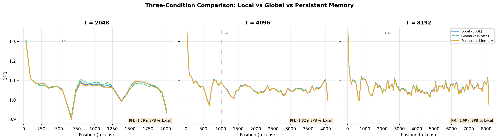
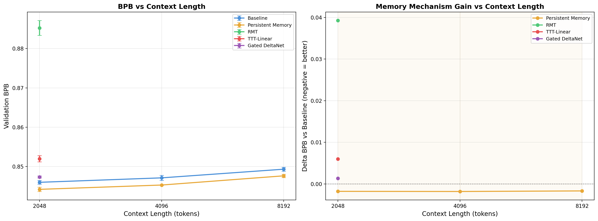
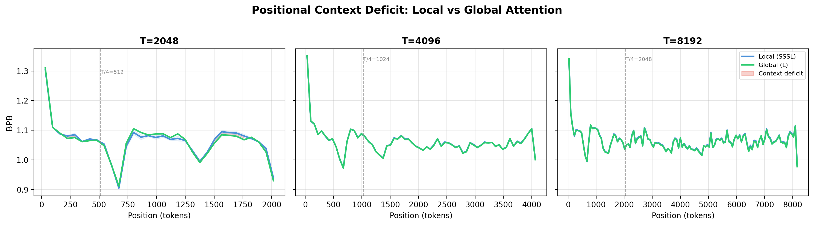

# memory-bench

A controlled benchmark for memory mechanisms in transformers, built on [nanochat](https://github.com/karpathy/nanochat).

Four memory mechanisms from recent papers, each plugged into the same 12-layer GPT-2 variant. Same model, same data, same optimizer, same training budget. The only variable is the memory system. The goal is to measure what actually helps under fair conditions at small scale, and to understand where the comparison breaks down.

## What this measures

Each mechanism is trained for 2,520 steps (~1.32B tokens) on FineWeb-Edu at 286M parameters. We evaluate bits-per-byte (BPB) across 2048, 4096, and 8192 token contexts using three attention conditions:

- **Local (SSSL)**: 3/4 layers use a short window (T/4), 1/4 use full context
- **Global**: all layers use full context (upper bound on attention quality)
- **Persistent Memory**: full causal attention with 32 learned KV pairs prepended per layer ([Sukhbaatar et al. 2019](https://arxiv.org/abs/1907.01470))

Note: Persistent Memory replaces the base attention module entirely rather than augmenting SSSL. This means the PM vs Global comparison isolates the contribution of learned memory tokens over full attention alone.

### Multi-context results (3 seeds per cell, paired by seed)

| Context | Local (SSSL) | Global (full attn) | Persistent Memory | PM vs Local | PM vs Global |
|---------|-------------|-------------------|-------------------|-------------|-------------|
| 2048 | 0.84599 | 0.84554 | 0.84420 | -1.79 mBPB | -1.34 mBPB |
| 4096 | 0.84712 | 0.84654 | 0.84529 | -1.82 mBPB | -1.24 mBPB |
| 8192 | 0.84932 | 0.84870 | 0.84763 | -1.69 mBPB | -1.07 mBPB |

### Mechanism comparison at T=2048 (4 seeds)

| Mechanism | Mean BPB | vs Baseline | p-value (paired t) |
|-----------|----------|-------------|---------------------|
| Baseline (SSSL) | 0.8459 | -- | -- |
| Persistent Memory | 0.8442 | -1.79 mBPB | 0.002 |
| Gated DeltaNet | 0.8473 | +1.35 mBPB | 0.008 |
| TTT-Linear | 0.8520 | +6.00 mBPB | <0.001 |
| RMT | 0.8852 | +39.25 mBPB | <0.001 |

Persistent Memory showed small but consistent improvements across all tested conditions. The other three mechanisms hurt performance in this setup. See [Limitations](#limitations-and-open-questions) for why "in this setup" matters.

<p align="center">

</p>
<p align="center"><em>Position-resolved BPB at three context lengths.</em></p>

<p align="center">

</p>

## Positional context deficit

The SSSL attention pattern creates a measurable positional context deficit: positions beyond the short-attention window boundary (T/4) show higher BPB under local attention than under global attention. This deficit grows with context length (0.53 mBPB at 2048, 0.59 at 4096, 1.38 at 8192).

Persistent Memory closes more than the full deficit at 4096 and 8192 (closure ratio > 1.0), meaning it outperforms even global attention. One possible interpretation, following [Darcet et al. 2024](https://arxiv.org/abs/2309.16588), is that learned memory tokens act as a compressed information bottleneck. This is a hypothesis worth testing further, not a conclusion -- mBPB-scale effects on 3 seeds are suggestive, not definitive.

<p align="center">

</p>

## Design

**Plug-and-play framework.** Each mechanism is a `MemoryModule` subclass. Adding a new mechanism means writing one file and implementing `wrap_model()` + `extra_param_groups()`. No modifications to the GPT backbone.

**Position-resolved evaluation.** BPB is broken down into 64-token position buckets, enabling analysis of where in the context each mechanism helps or hurts.

**Multi-seed, multi-context.** 4 seeds at T=2048, 3 seeds at T=4096 and T=8192. Paired by seed for within-subject comparisons. 42 total training runs.

## Experimental protocol

| Setting | Value |
|---------|-------|
| Architecture | nanochat 12L, 768d, 6 heads, GQA, QK-norm, RoPE (theta=100K) |
| Parameters | 286M base, +0.2% overhead for memory mechanisms |
| Attention | SSSL: 3 short-window layers (T/4) + 1 global layer, repeating |
| Data | FineWeb-Edu (101 shards, seed-shuffled; last shard = validation) |
| Optimizer | Muon (body) + AdamW (embed/head/memory params) |
| Training tokens | ~1.32B per run (2,520 steps) |
| Hardware | 8xH100 80GB SXM, DDP |

RoPE base frequency (100K) is inherited from nanochat and sufficient for all tested context lengths. Kept constant across conditions to avoid confounds.

### Why nanochat at 286M?

Each run takes 13-25 minutes. This enables 40+ runs with error bars on a single 8xH100 pod session, which matters more for a controlled comparison than running 2 seeds at 1.3B. The tradeoff is that results at this scale may not transfer to larger models.

The design is deliberately structured around what Taleb calls [convex tinkering](https://en.wikipedia.org/wiki/Antifragile_(book)): many cheap experiments with bounded downside (a failed 15-minute run wastes little) and open-ended upside (an unexpected result at small scale motivates a targeted large-scale follow-up). Rather than committing a large compute budget to one or two configurations, we spread it across 42 runs covering multiple mechanisms, context lengths, and seeds. Most runs confirm the null. A few surface something worth investigating further. The positional deficit framework came out of this process -- it was not planned in advance, but emerged from looking at where in the sequence each mechanism helped or hurt.

## Mechanisms

| Mechanism | Extra params | Approach | Reference |
|-----------|-------------|----------|-----------|
| Persistent Memory | 32 KV pairs/layer | Learned static tokens prepended to attention | [Sukhbaatar et al. 2019](https://arxiv.org/abs/1907.01470) |
| RMT | 16 memory tokens | Segment recurrence with truncated BPTT | [Bulatov et al. 2022](https://arxiv.org/abs/2207.06881) |
| TTT-Linear | Inner linear model | Per-token gradient descent on hidden state | [Sun et al. 2024](https://arxiv.org/abs/2407.04620) |
| Gated DeltaNet | Delta rule state | Linear attention + gated write-erase-write | [Yang et al. 2025](https://arxiv.org/abs/2406.06484) |

## Limitations and open questions

These matter. The results above should be read with all of them in mind.

**Effect sizes are small.** The PM improvement is ~1.7 mBPB, or about 0.2% of the baseline BPB. This is statistically significant with paired tests but the practical significance is an open question. No downstream evaluation (few-shot, generation quality) has been run to check whether mBPB-scale BPB gains translate to capability differences.

**Fixed budget may favor simple mechanisms.** All mechanisms train for the same 1.32B tokens. Persistent Memory adds 32 static KV pairs per layer -- almost nothing to learn. TTT-Linear has an inner optimization loop that must learn how to learn. Gated DeltaNet has recurrent state that takes time to train. A fixed budget inherently advantages the simplest mechanism. A fair follow-up would train TTT and DeltaNet for 5-10x longer tokens to check whether the gap closes.

**TTT-Linear underperformance needs investigation.** The original paper shows clear gains at larger scale. At 286M with 1.32B tokens and AdamW (instead of Muon, which TTT replacement params can't use due to DDP constraints), the inner loop may not have enough signal to converge. This is an open question, not a verdict on TTT.

**RMT is architecturally mismatched.** RMT's segment recurrence conflicts with SSSL's sliding window attention. Its +39 mBPB deficit likely reflects a harness incompatibility rather than a fundamental limitation. A fair RMT test would use a different base architecture.

**Sample sizes at longer contexts are thin.** 3 seeds at 4096/8192 gives 2 degrees of freedom for paired t-tests. The direction is consistent across seeds but the confidence intervals are wide. The multi-context results are directionally suggestive, not definitive.

**Single scale, single metric.** 286M parameters, BPB only. The original papers test at 340M-1.3B with multiple downstream tasks. Results here may not generalize to larger models or other evaluation criteria.

**Optimizer asymmetry.** TTT and DeltaNet replacement parameters use AdamW instead of Muon due to distributed optimizer constraints. This is a known conservative bias against those mechanisms.

## Project structure

```
memory_bench/
  mechanisms/
    base.py          MemoryModule ABC
    persistent.py    Persistent memory tokens
    rmt.py           RMT segment recurrence
    ttt.py           TTT-Linear (dual-form)
    deltanet.py      Gated DeltaNet (via FLA)
  eval/
    niah.py          Needle-in-a-haystack evaluation
    synthetic.py     BPB-by-position analysis
    perplexity.py    BPB evaluation
  train.py           Distributed training (DDP, Muon+AdamW)
  models.py          Config builder + param counting
analyze_results.py   Statistical analysis + figure generation
nanochat/            Git submodule (Karpathy's nanochat)
tests/               Test suite across 12 files
results/             JSON results + figures + auto-generated report
```

## Usage

```bash
git clone --recursive https://github.com/Robby955/memory-bench.git
cd memory-bench

# Install dependencies
pip install torch fla-core rustbpe tokenizers sentencepiece matplotlib scipy

# Download data + train tokenizer
NANOCHAT_BASE_DIR=/path/to/cache python -m nanochat.dataset -n 100
NANOCHAT_BASE_DIR=/path/to/cache python -m scripts.tok_train

# Single run (~13 min on 8xH100)
torchrun --standalone --nproc_per_node=8 -m memory_bench.train \
    --depth=12 --mechanism=persistent --seed=42 --max-seq-len=4096

# Full benchmark (~10 hours on 8xH100)
bash run_experiments.sh

# Analysis + figures
python analyze_results.py
```

## Tests

```bash
pytest tests/ -v
```

## License

MIT
