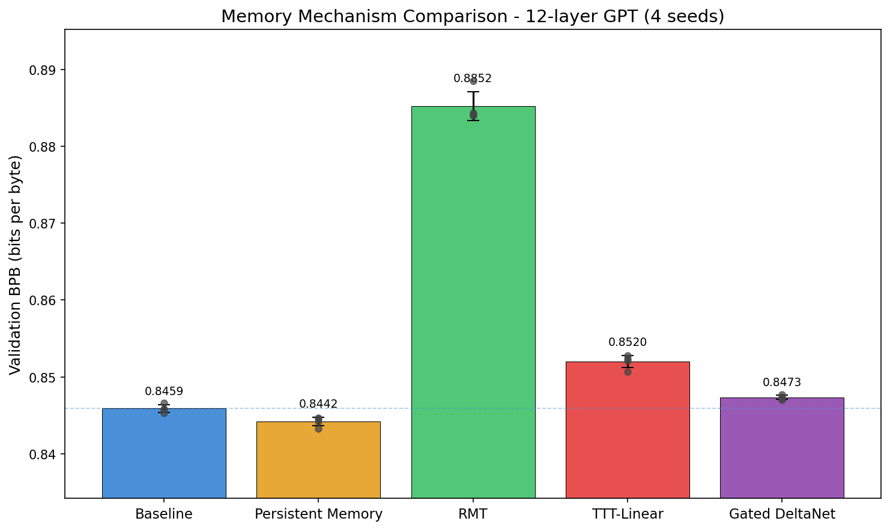
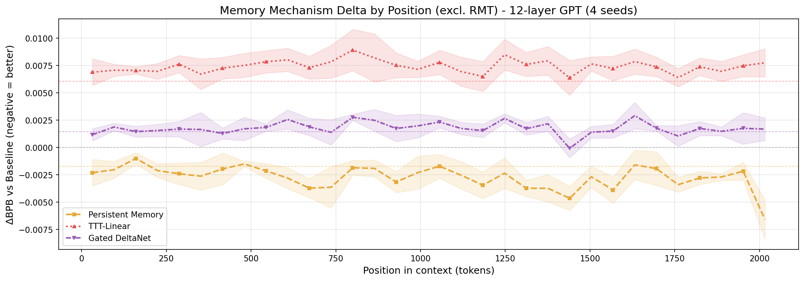

# memory-bench

Controlled benchmark of memory mechanisms for transformers, built on [nanochat](https://github.com/karpathy/nanochat).

Four memory mechanisms from recent papers, each plugged into the same nanochat 12-layer GPT. Same model, same data, same optimizer, same training steps. The only variable is the memory system.

## Results (2048 context, nanochat 286M, 4 seeds)

| Mechanism | s42 | s67 | s1337 | s3141 | Mean | vs Baseline |
|-----------|-----|-----|-------|-------|------|-------------|
| Baseline | 0.8467 | 0.8459 | 0.8458 | 0.8453 | 0.8459 | -- |
| Persistent Memory (32 tok) | 0.8442 | 0.8446 | 0.8447 | 0.8433 | 0.8442 | **-0.0017** |
| RMT (16 tok, seg=512, BPTT=2) | 0.8844 | 0.8839 | 0.8842 | 0.8885 | 0.8852 | +0.0393 |
| TTT-Linear (chunk=64) | 0.8528 | 0.8507 | 0.8521 | 0.8524 | 0.8520 | +0.0061 |
| Gated DeltaNet (layer 4) | 0.8472 | 0.8474 | 0.8477 | 0.8470 | 0.8473 | +0.0014 |

### Statistical significance (paired t-tests, df=3)

| Mechanism | Mean ΔBPB | 95% CI | p-value | Cohen's d | Sig |
|-----------|-----------|--------|---------|-----------|-----|
| Persistent Memory | **-0.0017** | [-0.0027, -0.0007] | 0.012 | -2.72 | ** |
| Gated DeltaNet | +0.0014 | [+0.0004, +0.0024] | 0.020 | 2.27 | ** |
| TTT-Linear | +0.0061 | [+0.0046, +0.0076] | 0.001 | 6.53 | *** |
| RMT | +0.0393 | [+0.0352, +0.0435] | <0.001 | 15.17 | *** |

All comparisons are statistically significant (p < 0.05). Significance: `***` p<0.01, `**` p<0.05.

**Bottom line:** At 2048 context, only Persistent Memory provides a statistically significant improvement over standard softmax attention.

- **Persistent Memory** consistently beats baseline across all 4 seeds (p=0.012, Cohen's d=-2.72). Learned static KV pairs act as background context at 0.2% parameter overhead. The improvement grows at later positions in the context window.
- **Gated DeltaNet** is close to softmax (+0.0014 BPB). Linear attention roughly matches quadratic attention at short context. At longer contexts, DeltaNet's O(n) scaling should provide a crossover point.
- **TTT-Linear** is mildly negative (+0.0061 BPB). At 2048 tokens, the inner model cannot accumulate enough signal to overcome its overhead.
- **RMT** is significantly hurt (+0.0393 BPB). Segment boundaries conflict with nanochat's sliding window attention -- tokens near boundaries lose access to local context that the baseline sees freely.

This is consistent with the original papers. These mechanisms were designed for 8k-1M+ context where standard attention degrades. At 2048 tokens, softmax attention is already highly effective.

### Figures

<p align="center">

</p>

<p align="center">

</p>

### BPB by context position

How does loss vary across the 2048-token sequence?

Each run produces a 32-bucket positional breakdown. Memory mechanisms should improve loss at later positions where accumulated context matters. All mechanisms show the expected curve shape (BPB drops from ~1.30 at the start to ~0.93 at position 2048), but the deltas between mechanisms are small at this context length.

Plots in `results/figures/`.

## Design

**Controlled comparison.** Same training loop, data, and training steps for every mechanism.

**Plug-and-play framework.** Each mechanism is a `MemoryModule` subclass. Adding a new mechanism means writing one file and implementing `wrap_model()` + `extra_param_groups()`. The training loop, evaluation, and statistics run automatically.

**BPB-by-position evaluation.** 32-bucket positional analysis showing where in the context each mechanism helps or hurts.

**Test suite** covering mechanism wrapping, numerical correctness, optimizer surgery, regression baselines, seed reproducibility, and CLI plumbing.

### Engineering notes

- **DistMuonAdamW + mechanism replacement params:** When TTT/DeltaNet replace attention blocks, their new parameters become "orphan params" not in the optimizer. Adding these to Muon groups causes CUDA illegal memory access during Newton-Schulz iteration. The workaround is adding them as AdamW groups. This means replacement params get a slightly weaker optimizer, which slightly disadvantages TTT/DeltaNet in this comparison.

- **DeltaNet + torch.compile:** FLA's Triton kernels are incompatible with torch.compile. Must use `--no-compile` for any mechanism using FLA.

## Known limitations

- **2048 context only.** The papers show benefits at 8k+ (TTT), multi-segment (RMT), or 100k+ (Infini-attention). Testing at 2048 confirms the negative result but doesn't test the regime where these mechanisms are designed to help. Extending to longer context is planned.

- **Single model scale (286M).** The original papers test at 340M-1.3B. Our scale is comparable to the smallest configurations.

- **Optimizer asymmetry.** TTT/DeltaNet replacement params use AdamW instead of Muon due to distributed optimizer constraints. This is a known conservative bias.

- **RMT's segment boundaries break nanochat's sliding window pattern.** This likely explains RMT's poor performance and may not reflect RMT's potential on a simpler architecture.

## Experimental protocol

| Setting | Value |
|---------|-------|
| Backbone | nanochat 12L, 768d, 6 heads, GQA, QK-norm, sliding window |
| Vocab | 32,768 (rustbpe BPE) |
| Data | ClimbMix-400B (101 shards, seed-shuffled; last shard = validation) |
| Optimizer | Muon (body) + AdamW (embed/head/memory) |
| Sequence length | 2048 |
| Batch size | 524,288 tokens |
| Training tokens | ~1.32B (2,520 steps) |
| Hardware | 8xH100 80GB, DDP |
| Metric | BPB (bits per byte) on held-out validation split |
| Seeds | 42, 67, 1337, 3141 |
| Time per run | ~13 minutes |

Training shard order is deterministically shuffled per-seed (validation shard always last). This ensures each seed sees the same data in a different order, isolating the effect of initialization variance from data ordering.

## Mechanisms

Each mechanism is a `MemoryModule` subclass in `memory_bench/mechanisms/`. One file per mechanism, no modifications to the GPT backbone.

### Persistent Memory
Learned KV pairs prepended to every attention layer. No positional encoding -- they act as static "background knowledge." Zero-init residual scale so the mechanism starts as identity.
Ref: [Burtsev et al. 2020](https://arxiv.org/abs/2006.05055)

### Recurrent Memory Transformer (RMT)
Input split into fixed segments. Memory tokens carry hidden states between segments. Truncated BPTT (depth=2) for gradient flow across segment boundaries.
Ref: [Bulatov et al. 2022](https://arxiv.org/abs/2207.06881)

### TTT-Linear (Test-Time Training)
One transformer layer replaced with an inner linear model updated per-token via SGD. The "hidden state" is the model weights. Mini-batch dual form for chunk-parallel computation.
Ref: [Sun et al. 2024](https://arxiv.org/abs/2407.04620)

### Gated DeltaNet
Softmax attention replaced with linear attention + delta rule. State matrix updated per-token via gated write-erase-write. Chunk-parallel training via FLA Triton kernels.
Ref: [Yang et al. 2025](https://arxiv.org/abs/2406.06484)

## Project structure

```
memory_bench/
├── mechanisms/
│   ├── base.py          MemoryModule ABC
│   ├── persistent.py    Persistent memory tokens (all layers)
│   ├── rmt.py           RMT segment recurrence
│   ├── ttt.py           TTT-Linear (dual-form, chunk-parallel)
│   └── deltanet.py      Gated DeltaNet (via FLA)
├── eval/
│   ├── niah.py          Needle-in-a-haystack evaluation
│   ├── synthetic.py     BPB-by-position analysis
│   └── perplexity.py    BPB evaluation
├── train.py             Distributed training (DDP, Muon+AdamW)
├── bench.py             Result aggregation + statistics
├── plot.py              Figure generation
└── models.py            Config builder + param counting
nanochat/                Git submodule (Karpathy's nanochat)
tests/                   Test suite (10 files + conftest)
run_experiments.sh       Full benchmark orchestration
```

## Usage

```bash
git clone --recursive https://github.com/Robby955/memory-bench.git
cd memory-bench

# Install dependencies
pip install torch fla-core rustbpe tokenizers sentencepiece matplotlib wandb

# Download data + train tokenizer (first time only)
NANOCHAT_BASE_DIR=/path/to/cache python -m nanochat.dataset -n 100
NANOCHAT_BASE_DIR=/path/to/cache python -m scripts.tok_train

# Single run
torchrun --standalone --nproc_per_node=8 -m memory_bench.train \
    --depth=12 --mechanism=none --seed=42

# Full benchmark: 5 mechanisms x 4 seeds
bash run_experiments.sh
```

Results save to `results/` as JSON. Each JSON includes full training metadata, BPB-by-position breakdown, and timing.

## Tests

```bash
pip install pytest
pytest tests/ -v
```

Covers: mechanism wrapping, numerical correctness, optimizer surgery, regression baselines, BPB evaluation, CLI plumbing, seed reproducibility.

## Contributing

The framework is designed to make adding new mechanisms easy. To add a mechanism:

1. Create a file in `memory_bench/mechanisms/` (see `persistent.py` for the simplest example)
2. Subclass `MemoryModule` and implement `wrap_model()` + `extra_param_groups()`
3. Register it in `memory_bench/mechanisms/__init__.py`
4. Run: `torchrun --standalone --nproc_per_node=8 -m memory_bench.train --mechanism=your_mechanism --seed=42`

Mechanisms we'd like to see benchmarked: Mamba2, RWKV-7, Infini-attention, Based, HGRN2. PRs welcome.

Other directions:
- Extend to 8192+ context where papers show real separation between mechanisms
- Multi-scale comparison (12L/24L)
- NIAH evaluation at extended context

## License

MIT
